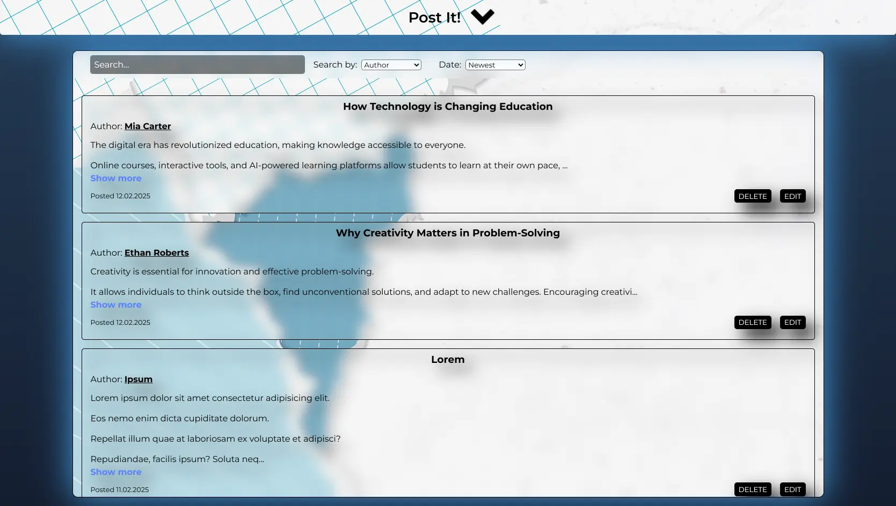
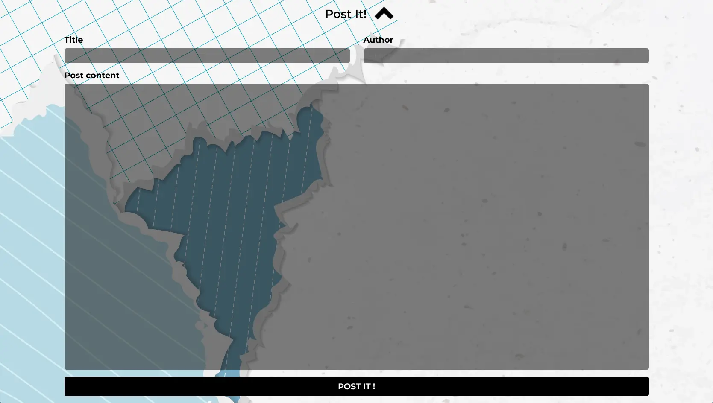
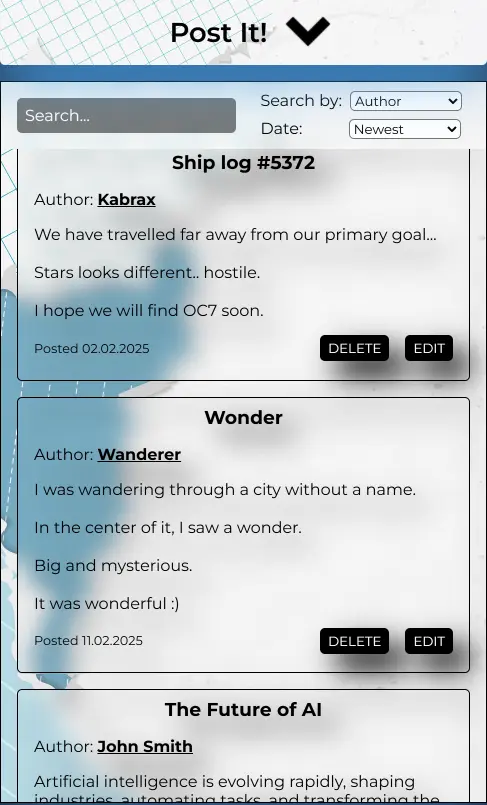

# Post It! - MERN stack app

## Screenshots

## General Information

Post It is a modern blog application that allows users to create, edit, and delete posts. Each post can include a title, author, content preview, and a timestamp. Users can also search for posts by author or sort them by date, making it easy to manage and explore notes efficiently.

The app provides a clean and responsive interface, displaying posts in individual cards with options to expand for full content, as well as edit or delete them. Features like live search and sorting enhance user experience, while interactive animations make the interface smooth and engaging.

## How to run app

### With docker

1. Install [docker desktop]("https://docs.docker.com/get-started/introduction/get-docker-desktop/")

2. Open in VSC and run command `"docker compose up --build"`

3. Have fun :)

### With vite and MongoDB

1. Navigate to /server and add .env file

-   add :
    `PORT = 5000`
    `LIVE_MONGODB_URL = "your mongoDB cluster adress"`

2. Navigate to ./server and run command npm run

3. Navigate to ./client and run command npm run

4. Enjoy

## Built with

-   [Semantic HTML5 markup](https://developer.mozilla.org/en-US/docs/Glossary/HTML5)
-   [SCSS](https://sass-lang.com/)
-   [TypeScript](https://www.typescriptlang.org/)
-   [React](https://reactjs.org/)
-   [Zustand](https://zustand-demo.pmnd.rs/)
-   [MongoDB](https://firebase.google.com/)
-   [Docker](https://www.docker.com/)
-   [Express](https://expressjs.com/)
-   [Framer Motion](https://www.framer.com/motion/)

## Author

-   Github - [Kabrax01](https://github.com/Kabrax01)
